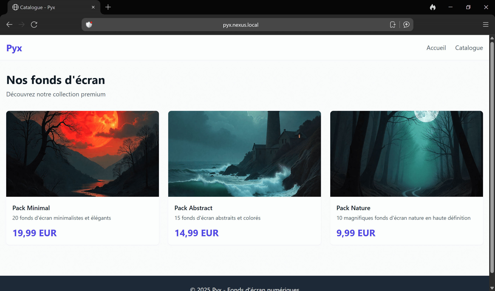
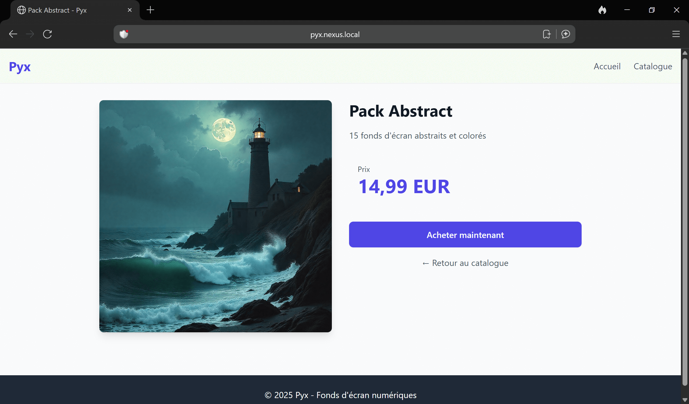
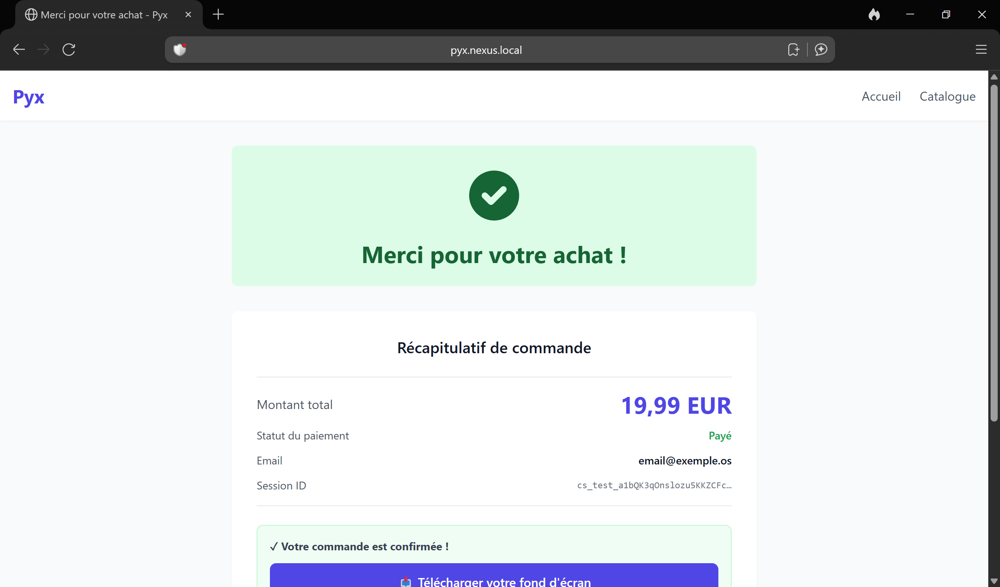
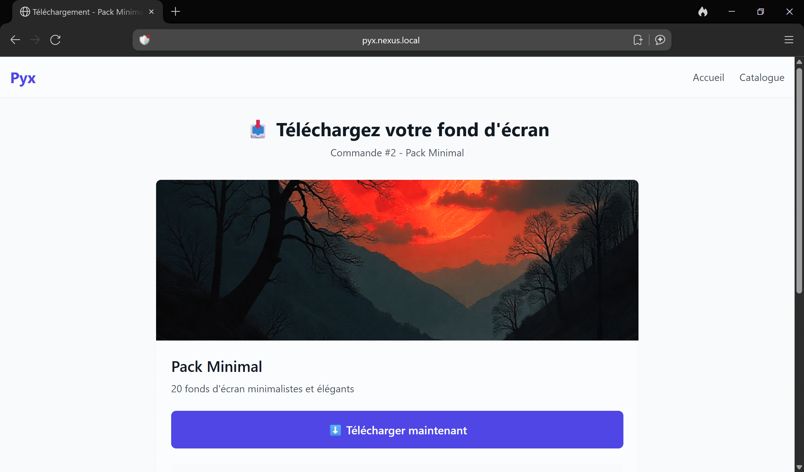

# Pyx — Digital Wallpapers Marketplace

[](CHANGELOG.md)
[](https://www.python.org/)
[](https://www.djangoproject.com/)
[](LICENSE)

> E-commerce minimaliste pour la vente de packs de wallpapers numériques avec paiement Stripe sécurisé, webhooks automatisés et téléchargements tokenisés.

**Nom commercial :** Pyx | **Nom technique :** DM (Digital Marketplace)



---

## ✨ Features

- 🛒 **Catalog & Product pages** - Interface moderne et responsive (Tailwind CSS)
- 💳 **Stripe Checkout** - Paiement sécurisé avec redirection hosted Stripe
- 🔔 **Webhooks Stripe** - Création automatique des commandes après paiement validé
- 🔐 **Téléchargements sécurisés** - Tokens uniques générés par commande (64 caractères)
- 📊 **Admin Django** - Gestion produits et commandes via back-office
- 🐳 **Dockerisé** - PostgreSQL 16 + Django 5 avec hot-reload
- 🌐 **Multi-environnements** - Configurations dev/nexus/prod avec Traefik
- 📝 **Logging complet** - Suivi événements webhook et téléchargements
- 🧪 **Tests intégrés** - Suite pytest pour intégration Stripe

---

## 🛠️ Stack Technique

**Backend & Frontend**
- Django 5.2.6 (SSR avec templates)
- PostgreSQL 16 (Alpine)
- Python 3.11

**Paiement & Sécurité**
- Stripe Checkout API
- Webhook signature verification
- Token-based downloads (`secrets.token_urlsafe`)

**Infrastructure**
- Docker Compose (multi-stage)
- Traefik (reverse proxy + TLS)
- nginx-static (media files)

**Outils**
- pytest (tests unitaires)
- Tailwind CSS (via CDN)

---

## 🚀 Quick Start

### Prérequis
- Docker & Docker Compose
- Git

### Installation

```bash
# 1. Cloner le repository
git clone https://github.com/MatthALXdev/dm.git
cd dm

# 2. Copier et configurer les variables d'environnement
cp .env.docker.example .env
# Éditer .env avec vos clés Stripe (test mode)

# 3. Lancer les containers
docker compose -f docker-compose.dev.yml up -d

# 4. Charger les fixtures (3 produits de test)
docker compose exec web python manage.py migrate
docker compose exec web python manage.py loaddata initial_data

# 5. Créer un superuser (optionnel)
docker compose exec web python manage.py createsuperuser
```

### Accès

- 🌐 **Application** : http://localhost:8000
- 🔧 **Admin Django** : http://localhost:8000/admin
- 📚 **Documentation** : [docs/](docs/)

---

## 📸 Screenshots

### Catalog Page

*Grid responsive de produits avec Tailwind CSS*

### Product Detail

*Page produit avec bouton d'achat Stripe*

### Payment Confirmation

*Confirmation paiement avec lien téléchargement*

### Secure Download

*Page téléchargement sécurisée par token unique*

---

## 🎯 Stripe Integration

### Configuration

1. Créer un compte [Stripe](https://dashboard.stripe.com/register)
2. Récupérer les clés API (test mode)
3. Configurer dans `.env` :
```bash
STRIPE_PUBLIC_KEY=pk_test_...
STRIPE_SECRET_KEY=sk_test_...
STRIPE_WEBHOOK_SECRET=whsec_...
```

### Webhook Setup (Production)

1. Dans [Stripe Dashboard > Webhooks](https://dashboard.stripe.com/test/webhooks)
2. Ajouter endpoint : `https://pyx.devamalix.fr/webhook/`
3. Sélectionner événement : `checkout.session.completed`
4. Copier le webhook secret dans `.env`

### Test Checkout

Carte de test Stripe : `4242 4242 4242 4242`
- Date : N'importe quelle date future
- CVC : N'importe quel 3 chiffres

Voir [docs/STRIPE_SETUP.md](docs/STRIPE_SETUP.md) pour le guide complet.

---

## 🏗️ Architecture

### Services Docker

```
┌─────────────────────────────────────────┐
│  Traefik (reverse proxy + TLS)          │
└─────────────┬───────────────────────────┘
              │
     ┌────────┴────────┐
     │                 │
┌────▼─────┐    ┌─────▼──────┐
│  Django  │    │  nginx-    │
│  (web)   │    │  static    │
└────┬─────┘    └────────────┘
     │
┌────▼──────────┐
│  PostgreSQL   │
│  (db)         │
└───────────────┘
```

### Flux Paiement

```
User → Product Page → Stripe Checkout → Payment
                           ↓
                     Webhook Event
                           ↓
                    Order Created (DB)
                           ↓
                  Thanks Page + Download Link
```

---

## 📚 Documentation

La documentation complète est dans [`docs/`](docs/) :

- **[CHANGELOG.md](CHANGELOG.md)** - Historique versions et modifications
- **[docs/STRIPE_SETUP.md](docs/STRIPE_SETUP.md)** - Guide intégration Stripe
- **[docs/DOCKER-COMPOSE-CONFIGS.md](docs/DOCKER-COMPOSE-CONFIGS.md)** - Configurations environnements
- **[docs/INFRASTRUCTURE.md](docs/INFRASTRUCTURE.md)** - Architecture nginx-static + Traefik
- **[docs/checklists/](docs/checklists/)** - Checklists sécurité et déploiement

---

## 🔐 Sécurité

### Implémenté (v0.4.0)

- ✅ Webhook signature verification (Stripe)
- ✅ CSRF protection (Django middleware)
- ✅ Token-based downloads (secrets.token_urlsafe)
- ✅ Environment variables pour secrets
- ✅ PostgreSQL network isolation (Docker)
- ✅ SQL injection protection (Django ORM)

### Checklist

Voir [docs/checklists/s1_security_checklist.md](docs/checklists/s1_security_checklist.md) pour la liste complète.

---

## 🧪 Tests

```bash
# Lancer tous les tests
docker exec dm_web pytest

# Tests Stripe uniquement
docker exec dm_web pytest core/test_stripe.py -v

# Avec coverage
docker exec dm_web pytest --cov=core --cov-report=html
```

**Tests implémentés (19 tests) :**
- Checkout session creation
- Webhook signature verification
- Order creation via webhook
- Token-based downloads
- Security (SQL injection, XSS, CSRF)

---

## 📦 Versions

Voir [CHANGELOG.md](CHANGELOG.md) pour l'historique complet.

### Versions récentes

- **v0.4.0** (2025-12-09) - Webhooks Stripe + téléchargements sécurisés
- **v0.3.0** (2025-12-08) - Intégration Stripe Checkout
- **v0.2.1** - Rebrand Pyxalix → Pyx
- **v0.2.0** - UI moderne + infrastructure nginx-static
- **v0.1.2** - Dockerisation complète

### Roadmap

- **v0.5.0** - Tests unitaires automatisés (pytest + coverage)
- **v0.6.0** - CI/CD GitHub Actions
- **v1.0.0** - Walking skeleton complet (Sprint 1)

---

## 🌍 Environnements

### Local Development
```bash
docker compose -f docker-compose.dev.yml up -d
# http://localhost:8000
```

### Nexus (Test interne)
```bash
docker compose -f docker-compose.nexus.yml up -d
# http://pyx.nexus.local (Traefik routing)
```

### Production VPS
```bash
docker compose -f docker-compose.yml up -d
# https://pyx.devamalix.fr (Traefik + Let's Encrypt)
```

---

## 🤝 Contribution

Ce projet est développé dans le cadre d'un **portfolio professionnel** pour alternance.

Pour contribuer :
1. Fork le projet
2. Créer une branche feature (`git checkout -b feature/amazing-feature`)
3. Commit les changements (`git commit -m 'feat: add amazing feature'`)
4. Push vers la branche (`git push origin feature/amazing-feature`)
5. Ouvrir une Pull Request

---

## 📝 License

Ce projet est sous licence MIT. Voir [LICENSE](LICENSE) pour plus de détails.

---

## 👤 Auteur

**Matthieu** (MatthALXdev)

- GitHub: [@MatthALXdev](https://github.com/MatthALXdev)
- Portfolio: [devamalix.fr](https://devamalix.fr)
- Projet: [pyx.devamalix.fr](https://pyx.devamalix.fr)

---

## 🙏 Remerciements

- [Stripe](https://stripe.com) - Plateforme de paiement
- [Django](https://www.djangoproject.com/) - Framework web Python
- [Tailwind CSS](https://tailwindcss.com/) - Framework CSS
- [PostgreSQL](https://www.postgresql.org/) - Base de données

---

**Made with ❤️ for learning and portfolio purposes**
